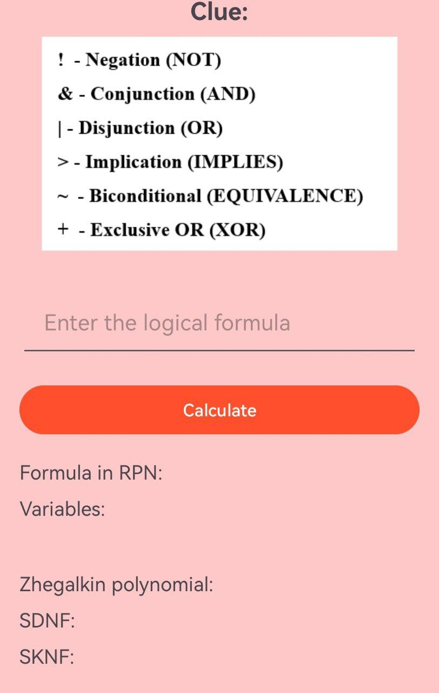
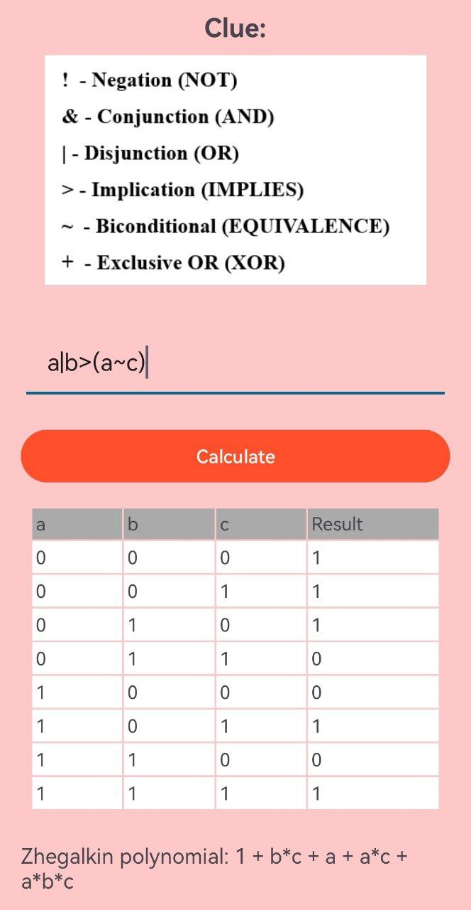

# Truth Table and Boolean Logic Application

This Android application calculates **Truth Tables** and evaluates **Boolean logic formulas**. It provides several features to process logical expressions, including conversion to **Reverse Polish Notation (RPN)**, generation of **SDNF (Disjunctive Normal Form)**, **SKNF (Conjunctive Normal Form)**, and **Zhegalkin Polynomials**.

## Features:

- **Input Boolean Formula**: Enter a logical expression using variables (letters), logical operators (`!`, `&`, `|`, `>`, `~`, `+`), and parentheses `()`.
- **RPN Conversion**: The app converts the input formula into **Reverse Polish Notation (RPN)**, which is useful for evaluation and further processing.
- **Truth Table Generation**: The app computes and displays the truth table for the formula, showing the output for every combination of variable values.
- **SDNF (Disjunctive Normal Form)**: Computes the **Disjunctive Normal Form** based on the truth table.
- **SKNF (Conjunctive Normal Form)**: Computes the **Conjunctive Normal Form** based on the truth table.
- **Zhegalkin Polynomial**: Computes the **Zhegalkin Polynomial** representing the Boolean function.

## 🖼️ Screenshots

| Main Screen | Calculate Screen |
|-------------|------------|
|  |  |


## Technologies Used:

- **Kotlin**: For building the Android application.
- **Android SDK**: For designing and building the user interface (UI).
- **Boolean Logic**: To process the logical formulas and generate results.
  
## Getting Started:

1. Clone the repository to your local machine:
   ```bash
   git clone https://github.com/ZvonitCodi/TruthTableandBooleanLogicApplication.git
